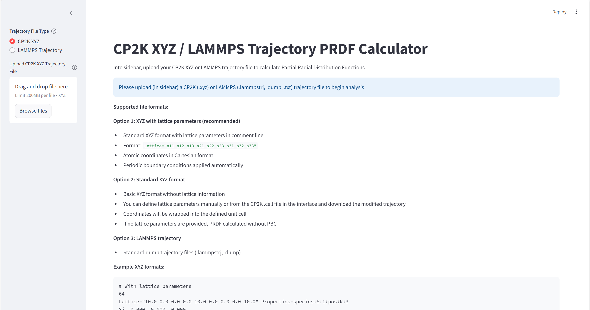
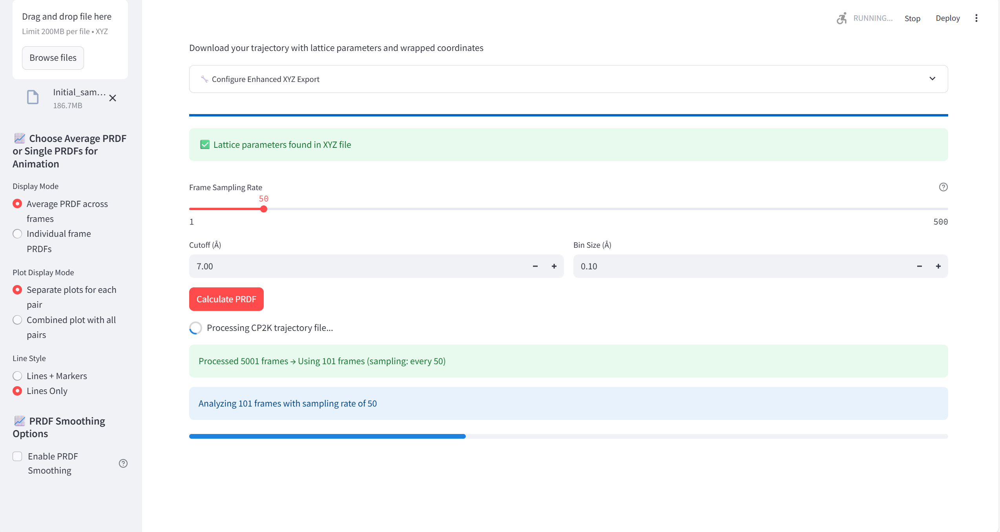
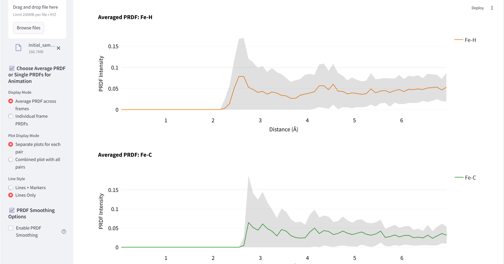
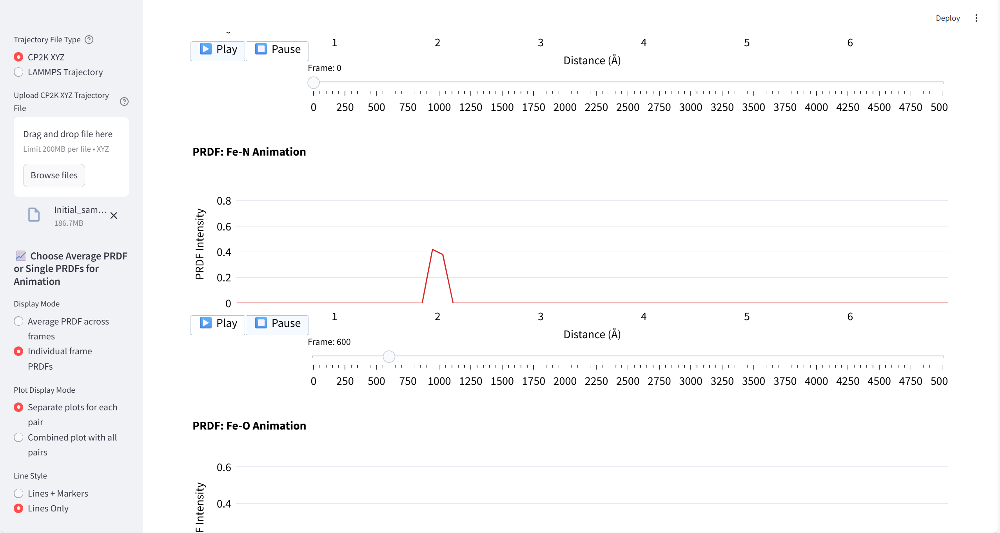

# PRDF-CP2K-LAMMPS
GUI for calculating partial radial distribution functions (PRDF) and RDF from CP2K XYZ or LAMMPS trajectories. Additionally, it can union files for XYZ atomic configurations and CELL file from CP2K. Video tutorial will be available at July.

# How to compile
1) git clone https://github.com/bracerino/PRDF-CP2K-LAMMPS.git
3) cd PRDF-CP2K-LAMMPS/
4) python3 -m venv prdf_env
5) source prdf_env/bin/activate
6) pip install -r requirements.txt
7) streamlit run app.py

# Tested versions of Python and packages
- Python 3.13.3

- streamlit 1.45.1
- pymatgen 2025.5.2
- matminer 0.9.3
- ase 3.25.0
- numpy 2.2.6
- pandas 2.2.3
- scipy 1.15.3
- matplotlib 3.10.3

## Workflow overview
- Upload your trajectory file, set the parameters of PRDF and frequency of how often the PRDF should be calculated (frame frequency).

- Observe the calculated average PRDF

- Observe the calculated PRDF at each sampled frame as an animation
  
